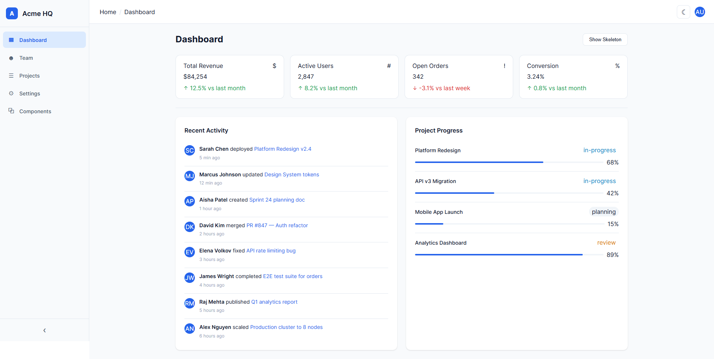
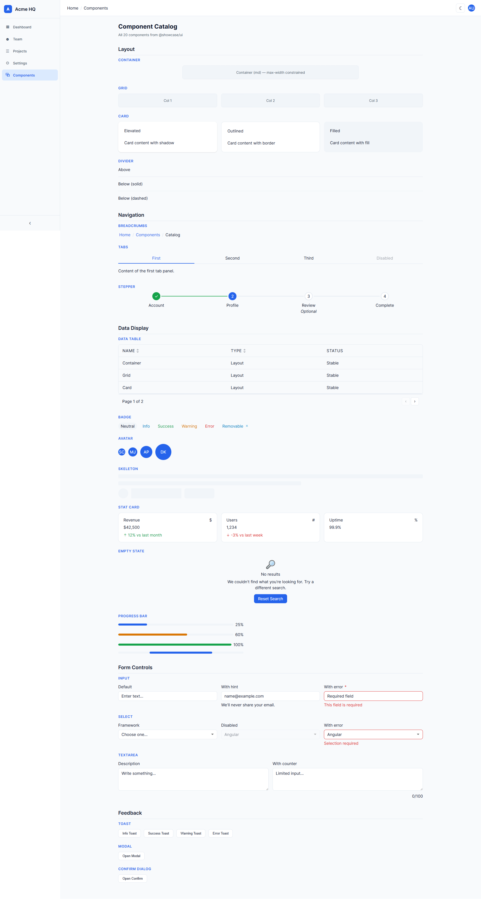
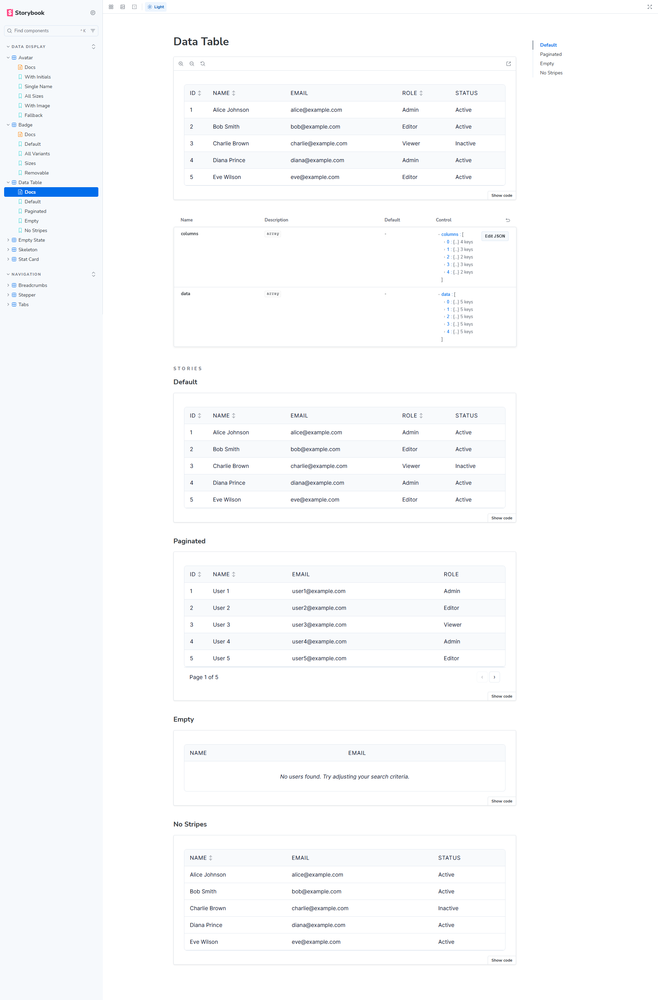
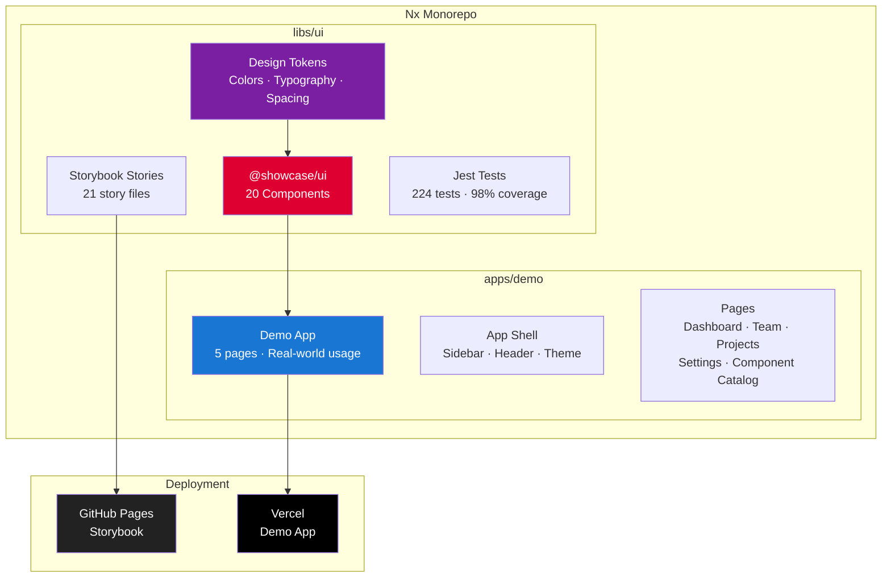

# @showcase/ui — Angular Component Library

[](https://github.com/jayampathiw/angular-component-library/actions)
[](https://angular.dev)
[](https://jayampathiw.github.io/angular-component-library)
[](https://nx.dev)
[](https://github.com/jayampathiw/angular-component-library)
[](https://github.com/jayampathiw/angular-component-library)
[](LICENSE)

A production-ready, enterprise-grade Angular component library with **20 reusable components**, comprehensive Storybook documentation, and a full demo application showcasing real-world usage.

**[Live Demo App](https://angular-component-library.vercel.app/dashboard)** · **[Storybook](https://jayampathiw.github.io/angular-component-library)** · **[GitHub](https://github.com/jayampathiw/angular-component-library)**

---

## Screenshots

### Demo App — Dashboard


### Demo App — Component Catalog


### Storybook — Interactive Docs


> Screenshots live in `docs/screenshots/`. To update, take new captures and replace the images.

---

## Highlights

- **20 components** across 5 categories — Layout, Navigation, Data Display, Form Controls, Feedback
- **Angular 21** with Signals, standalone components, and new control flow (`@if`, `@for`, `@switch`)
- **Design token system** with light/dark theme support via CSS custom properties
- **98% test coverage** — 224 tests across 20 test suites
- **Storybook 10** — interactive docs with Controls, Docs, and a11y addon
- **Nx 22 monorepo** — publishable library (`@showcase/ui`) + demo app
- **CI/CD** — GitHub Actions for lint/test/build + auto-deploy Storybook to GitHub Pages
- **WCAG 2.1 AA** — keyboard navigation, ARIA labels, focus management

---

## Component Catalog

| Category | Components |
|----------|-----------|
| **Layout** | Container, Grid, Card, Divider |
| **Navigation** | Breadcrumbs, Tabs, Stepper |
| **Data Display** | Data Table, Badge, Avatar, Skeleton, Stat Card, Empty State, Progress Bar |
| **Form Controls** | Input, Select, Textarea |
| **Feedback** | Toast, Modal, Confirm Dialog |

---

## Architecture



---

## Tech Stack

| Layer | Technology |
|-------|-----------|
| **Framework** | Angular 21 (Signals, Standalone, New Control Flow) |
| **Monorepo** | Nx 22 |
| **Component Dev** | Storybook 10 (CSF3 + Docs + a11y addon) |
| **Styling** | SCSS + Design Token system (CSS custom properties) |
| **Testing** | Jest 30 + jest-preset-angular (zoneless) |
| **Linting** | ESLint 9 + Angular ESLint + Prettier |
| **CI/CD** | GitHub Actions → GitHub Pages (Storybook) + Vercel (Demo) |
| **Package** | ng-packagr (publishable Angular library) |

---

## Demo App Pages

The demo app (`apps/demo/`) showcases the library in a realistic "Acme HQ" admin panel:

| Page | Components Used | What It Demonstrates |
|------|----------------|---------------------|
| **Dashboard** | StatCard, Grid, Card, ProgressBar, Avatar, Badge, Skeleton, Divider | KPI cards, activity feed, project progress, skeleton loading states |
| **Team** | Avatar, Badge, Input, Select, Modal, ConfirmDialog, EmptyState, Container | Search & filter, CRUD modals, confirmation dialogs, empty states |
| **Projects** | Card, Grid, Stepper, ProgressBar, Badge, Avatar, Divider | Project cards, workflow stepper, progress tracking |
| **Settings** | Tabs, Input, Select, Textarea, Card, Divider, Container | Tabbed forms, theme toggle, profile editing |
| **Component Catalog** | All 20 components | Complete reference of every component with variants |

---

## Getting Started

### Prerequisites

- Node.js 20+
- pnpm 10+

### Installation

```bash
git clone https://github.com/jayampathiw/angular-component-library.git
cd angular-component-library
pnpm install
```

### Development

```bash
# Start the demo app (http://localhost:4200)
pnpm start

# Start Storybook (http://localhost:4400)
pnpm storybook

# Run tests
pnpm test

# Run tests with coverage
pnpm nx test ui --coverage

# Lint
pnpm lint

# Build the library
pnpm build
```

---

## Project Structure

```
angular-component-library/
├── apps/
│   └── demo/                    # Demo application (Acme HQ)
│       └── src/app/
│           ├── pages/           # Dashboard, Team, Projects, Settings, Catalog
│           └── shared/          # Layout (sidebar, header), services, mock data
├── libs/
│   └── ui/                      # @showcase/ui — publishable library
│       └── src/
│           ├── lib/             # 20 components (each: .ts, .scss, .spec.ts, .stories.ts)
│           └── styles/          # Design tokens, theme, global styles
├── .github/workflows/ci.yml    # CI + Storybook deploy to GitHub Pages
├── .storybook/                  # Storybook root config
├── vercel.json                  # Demo app deployment config
└── nx.json                      # Nx workspace config
```

---

## Design Token System

All components use semantic design tokens via CSS custom properties — no hardcoded colors:

```scss
// Colors
--ui-color-primary
--ui-color-on-primary
--ui-color-surface
--ui-color-surface-container
--ui-color-on-surface
--ui-color-error
--ui-color-success
--ui-color-warning

// Typography
--ui-font-family
--ui-font-size-sm / md / lg

// Spacing
--ui-spacing-xs / sm / md / lg / xl

// Shape
--ui-radius-sm / md / lg / xl
```

Light/dark theme switches automatically via `[data-theme="dark"]` attribute — all tokens update, zero component changes needed.

---

## Quality Metrics

| Metric | Value |
|--------|-------|
| Components | 20 |
| Test Suites | 20 (+ 1 demo) |
| Total Tests | 224 |
| Statement Coverage | 98.36% |
| Branch Coverage | 88.31% |
| Line Coverage | 100% |
| Storybook Stories | 21 files |
| Bundle Size (library) | Tree-shakeable per-component |

---

## Key Patterns Demonstrated

This project showcases modern Angular patterns that enterprise clients look for:

| Pattern | Where Used | Example |
|---------|-----------|---------|
| **Signal Inputs** (`input()`, `input.required()`) | All 20 components | `readonly variant = input<Variant>('default')` |
| **Signal Outputs** (`output()`) | Toast, Modal, ConfirmDialog, Badge | `readonly dismissed = output<void>()` |
| **Two-Way Binding** (`model()`) | Input, Select, Textarea, Modal | `readonly value = model<string>('')` |
| **Computed Signals** (`computed()`) | Host classes, filtered data | `readonly hostClasses = computed(() => ...)` |
| **OnPush Change Detection** | All components | `changeDetection: ChangeDetectionStrategy.OnPush` |
| **Standalone Components** | All components (zero NgModules) | `standalone: true` with explicit imports |
| **New Control Flow** | All templates | `@if`, `@for` with `track`, `@switch` |
| **`inject()` Function** | Services, router, document | `private readonly router = inject(Router)` |
| **Design Token Architecture** | SCSS token system | CSS custom properties with light/dark themes |
| **Host Element Binding** | Component styling | `host: { class: 'ui-badge', '[class]': 'hostClasses()' }` |
| **Content Projection** | Card, Modal, Tabs | `<ng-content select="[card-header]" />` |
| **Publishable Library** | Nx + ng-packagr | Tree-shakeable FESM2022 bundles |
| **Zoneless Testing** | Jest setup | `setupZonelessTestEnv()` with signal-based tests |

---

## Author

**Jayampathy Wijesena** — Senior Angular Developer

- Portfolio: [jayampathiw.github.io/Portfolio](https://jayampathiw.github.io/Portfolio)
- LinkedIn: [linkedin.com/in/jayampathy-wijesena](https://linkedin.com/in/jayampathy-wijesena)
- GitHub: [github.com/jayampathiw](https://github.com/jayampathiw)

---

## License

[MIT](LICENSE)
